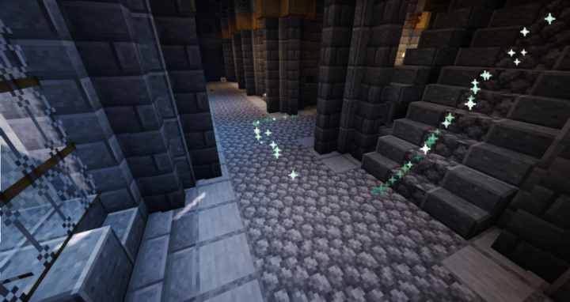

# PathFinder - Introduction

## What is the PathFinder Plugin?

The PathFinder Plugin is an extension for your Minecraft server. It allows your users to find shortest paths across
mazes, towns or even whole maps. Also, it can be configured to make points of interest discoverable, so that a player
first has to find a location once on his or her own and then can use the navigation functionality.

The calculated shortest path can be visualized in a variety of ways by default. If these visualizer types are not
sufficient for your project, new visualizer types can easily be added via developers API as extension to PathFinder.

*Example path through a version of hogwarts that we built some time ago.*

## How does it work?

To solve problems like the finding of the shortest path across a town map or the navigation of a mob in a video game,
some mathematical steps are required. But before lulling you with interesting background information, lets talk about
that part that affects the usage of the plugin.
Navigation problems are mostly based on a web-like structure like a roadmap, a routing like the internet or the whole
earth like in Google Maps.
This structure is called a graph. Every intersection of so called edges on this graph is called a node.

// TODO img

To find the shortest path on a graph, several algorithms exist and are automatically computed by the plugin.
(You may want to think it through, just taking every possible route and comparing their length will quickly become a
tremendous amount of calculations to do)
What you as administrator have to do to use this plugin is to create this exact graph in your minecraft world.
PathFinder offers some editing tools to easily define nodes, edges, edge weights (steeper or cobbled roads take longer),
directions (one way roads), locations (by packing nodes to groups).

## Background

Graph theory is a topic that deals with all kinds of problems regarding graphs.
